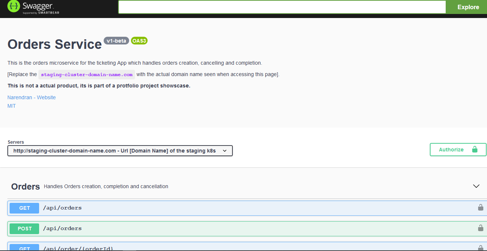
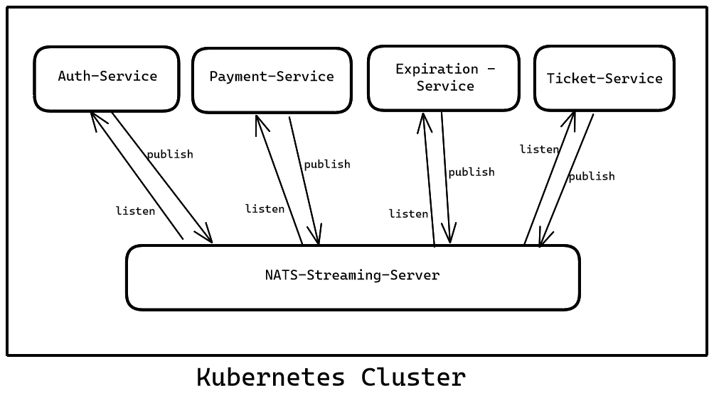
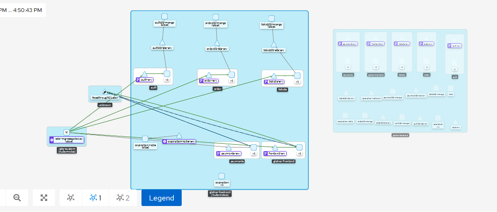
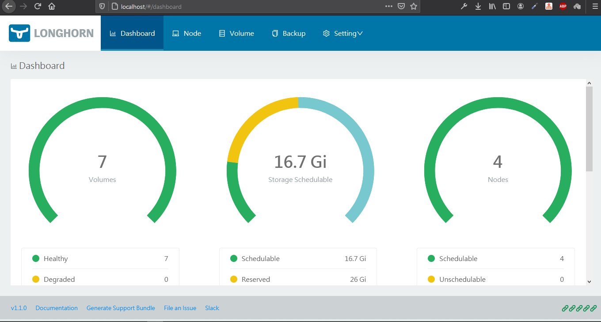
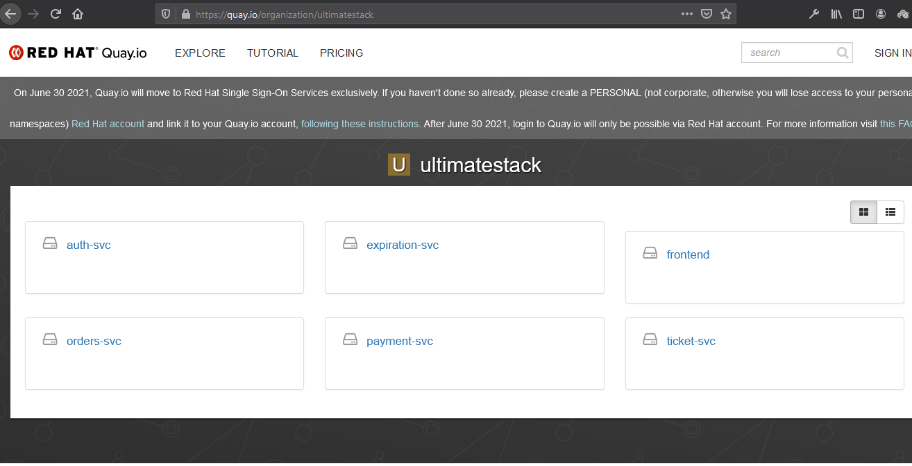
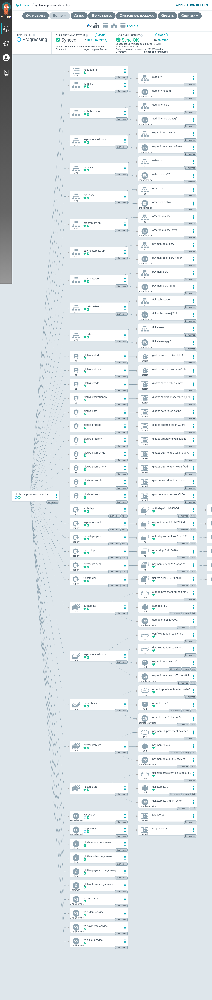
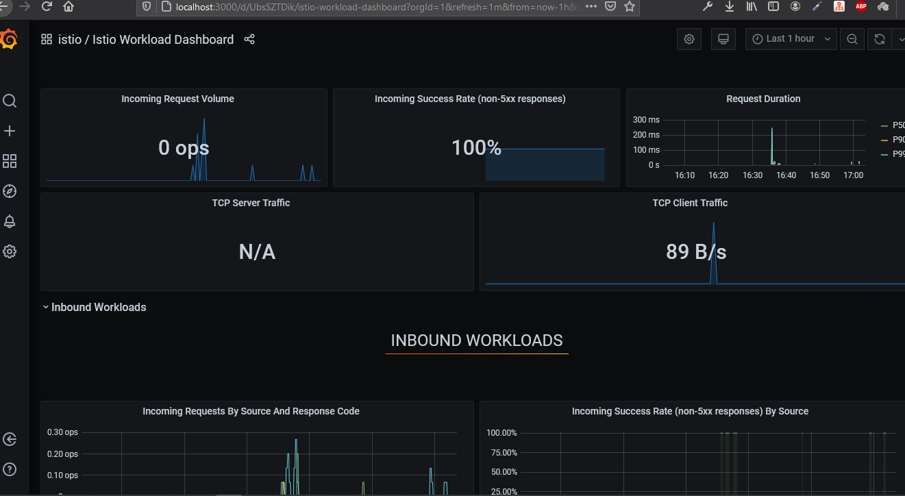
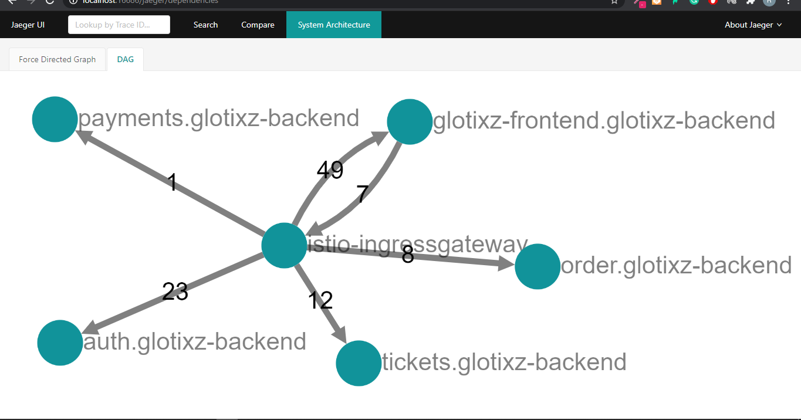
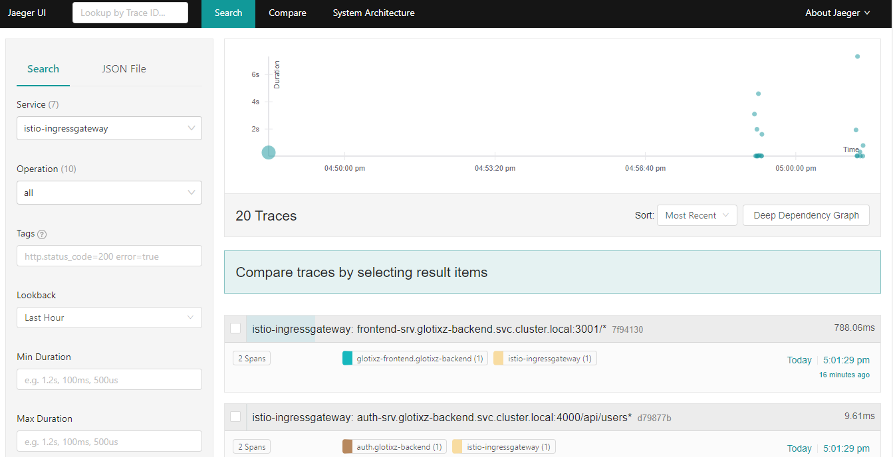

# <div align="center" >🌟🌟🌟🌟🌟 Glotixz - Ultimate Stack 🌟🌟🌟🌟🌟</div>


 **Ultimate Stack** *[Glotixz]* is a  Event Driven Microservices Fullstack Ecommerce App deployed and  running on `Kubernetes` with `istio` as the *`service-mesh`* and cloudnative serverless components by `knative` and deployed to k8s via Gitops pipeline with `ArgoCD` and the kubernetes platform is built as Infrastructure as Code [IaC] with `Terraform` .


The complete Glotixz microservices apps are developed and deployed in [CIVO Kubernetes platform](https://www.civo.com/).

> #### ✨✨✨Note 📚:
> The deployments are optimized only for staging k8s cluster only and not yet for production cluster.

## ✨✨✨ Overview 🍁:

Ultimate Stack [Glotixz] is a Typescript/Javascript based fullstack ecommerce app which can be used to sell tickets for events by users registered in the app and payment is fullfilled by [stripe](stripe.com).

The Backend services are a microservices built with [Expressjs](https://expressjs.com/) + [Typescript](https://www.typescriptlang.org/) which are event driven systems with the [`nats-streaming-server`](https://nats.io/) as the event-bus publishing/delivering events from and  to the services respectively.

All the backend serivces along with their respective databases and frontend is deployed in kubernetes by Gitops via [`ArgoCD`](https://argoproj.github.io/projects/argo-cd/)

The complete overview of the Architecture and workflow:

 Overall Architecture Overview")


#### ✨Tools used during development and pre & post deployment 🛠️ :

- [vscode](https://code.visualstudio.com/) - Code Editior of choice
- [okteto cli](https://okteto.com/docs/getting-started/installation) - cloudnative dev container management tool
- [kubectl](https://kubernetes.io/docs/tasks/tools/#kubectl) - CLI to interact with Kubernetes Cluster
- [kubens & kubectx](https://github.com/ahmetb/kubectx) - awesome tools to help with switiching namespaces and cluster contexts respectively with ease
- [istioctl](https://istio.io/latest/docs/setup/getting-started/#download) - CLI to install and interact with istio in the k8s cluster
- [kubeseal](https://github.com/bitnami-labs/sealed-secrets/releases) - CLI to create sealedsecrets by interacting with the k8s cluster
- [terraform](https://www.terraform.io/downloads.html) - To provision k8s cluster and other resources with the preferred providers via IaC [Infrastructure as Code]
- [kn](https://www.knative.dev/docs/client/install-kn/) - CLI to create/interact with KNative deployments in the k8s cluster
- [argocd](https://github.com/argoproj/argo-cd/releases/latest) - CLI to interact with argocd resources in the kubernetes cluster
- [draw.io](draw.io) - to create the architecture overview diagram
- [Excalidraw](https://www.excalidraw.com/) - used to sketch out various simple architecture decision diagrams

### ✨✨ Cloud Native development ☸️🧰♻️💻:

This project is entirely built with cloud native development process on kubernetes with the use of the [okteto cli](https://okteto.com/docs/getting-started/installation). 
Okteto cli make the development process ease with the use of the [okteto.yaml](https://okteto.com/docs/reference/manifest) manifest file as it does the abstraction of connection between the local IDE/Editor (vscode was my preferred editor).

Every service folder will have a [`okteto.yml`]('./Auth-Service/okteto.yml') manifest file. This file can be generated with followig command:

```bash

$>> okteto init

```

The `okteto init` command will scan the available deployments in your Kubernetes namespace, and ask you to pick one deployment where we want to do our development.

> ### ✨✨Note 📚:
> *Okteto CLI* will work only if we have the kubernetes config file set in the `~/.kube` folder or `KUBECONFIG="/Foldername/config"` as a environment variable. 

the okteto.yml file will be like the following:

```yaml

#this it the developemt-service name we can set which will reflect in the k8s environment dev container in the deployment.

name: mcs-auth-service 

# autocreate when set to true will create a new deployment if it's not present already.

autocreate: true 

# this is the container image used inside the development container.

image: quay.io/narendev/fishnode:1.0

# the first command which to be executed when the dev container is up.

command: fish

# This will set which folders & files to track and sync for the new changes happens in the dev container to the local files respectively. [The synchronization is completely taken care by the okteto cli (which is awesome !!!) ]

sync:
- .:/usr/src/app

# These are the ports forwarded from the container to the local system

forward:
- 9229:9229
- 3000:3000
persistentVolume: {}

# Annotations which needs to be applied on the container while deploying can be mentioned under this `annotations` section

annotations:
  sidecar.istio.io/inject: "false"

```

Now, we have the `okteto.yml` file, now run the okteto command to start/stop the dev container in the kubernetes:


To starting the dev container:
```bash

$>> okteto up

```

To stop the dev container:
```bash

$>> okteto down

```


> ### ✨✨Note 📚:
> Okteto have a vscode extension which will help a lot by streamlinging the dev process by just few clicks.
> [https://marketplace.visualstudio.com/items?itemName=okteto.remote-kubernetes](https://marketplace.visualstudio.com/items?itemName=okteto.remote-kubernetes)

### ✨✨ Infrastructure as Code with Terraform:

[Terraform](https://www.terraform.io) is a tool for building, changing, and versioning infrastructure safely and efficiently. Terraform can manage existing and popular service providers as well as custom in-house solutions.

The kubernetes clusters is created with the terrafrom.

It's a good practice to have a `dev`, `staging` and `production` clusters to streamline the `development` , `testing` and `production` deployment process aligned respectively.

These different clusters can be created with ease by using terraform and utilizings it [`workspace`](https://www.terraform.io/docs/language/state/workspaces.html) feature to create many cluster with the same config in the provider of our choice.

https://www.terraform.io/docs/language/state/workspaces.html

Version of terraform used:
```bash
$>> terraform version
Terraform v0.15.0

```
The terraform IaC codes is in the ['./Terraform']("./Terraform") folder.


### ✨✨ Frontend:

The Frontend for the Glotixz app is created by using the [`NextJS`](https://nextjs.org/) - a reactjs based Javascript framework.


### ✨✨ Details of the Backend MicroServices ⛓️✡️🔅:
The Backend services are written in `Typescript` with `Expressjs` web framework  which runs on the `NodeJS` **v14** runtime.

There are a total of 5 microservices which handles one core group functionality each respectively. The microservices are:
- `Auth-Service`
- `Expiration-Service`
- `Orders-Service`
- `Payment-Service`
- `Ticket-Service`

All the services endpoints are covered with tests via `Jest` testing library.

#### ✨ Auth-Service : 
This microservice have endpoints for the user creation `signup` and authentication of users like `signin`,`signout` and `currentuser`. The authroization is done via creation of `JWT` tokens which are sent via `Cookies` \ `Session-Cookies` which is used by the other microservices to know about the user access and authorization privilages.The auth-service uses a `MongoDB` as its' database which is also deployed in the cluster as a `statesfulset` resource.

The [`Auth-Service`]('./Auth-Service') folder have the code for the Auth-Service microservice.

#### ✨ Expiration-Service:
This microservice endpoints are used internally by other microservices and not exposed to the users. This microservice keeps track of the expiraiton time and sends a `event` to the `event-bus` when the expiration time for a order is reached. This microservies use a redisDB as its' database which is also deployed in the cluster as a `statefulset` resource.

The [`Expiration-Service`]('./Expiration-Service) folder have the code for the Expiration-Service microservice.

#### ✨ Orders-Service:
This microservice have endpoints for the order creation, listing , deleting and showing a particular order. The Orders-Service will expect to receive the `Authentication Cookie` to validate if the user is authenticated to access the protected routes along with the request. The orders-service uses a `MongoDB` as its' database which is also deployed in the cluster as a `statesfulset` resource.

The [`Orders-Service`]('./Orders-Service') folder have the code for the Orders-Service microservice.


#### ✨ Payment-Service:
This microservice have endpoints for fullfilling a Orders' payment with [`Stripe`](https://www.stripe.com). The Payment-Service will expect to receive the `Authentication Cookie` to validate if the user is authenticated to access the protected routes along with the request. The payment-service uses a `MongoDB` as its' database which is also deployed in the cluster as a `statesfulset` resource.

The [`Payment-Service`]('./Payment-Service') folder have the code for the Payment-Service microservice.


#### ✨ Ticket-Service:
This microservice have endpoints for the creation,listing, updating and showing tickets. The Ticket-Service will expect to receive the `Authentication Cookie` to validate if the user is authenticated to access the protected routes along with the request. The Ticket-service uses a `MongoDB` as its' database which is also deployed in the cluster as a `statesfulset` resource.

The [`Ticket-Service`]('./Ticket-Service') folder have the code for the Ticket-Service microservice.


### ✨✨ Swagger OpenAPI spec:
The Backend services endpoints are documented with [**Swagger OpenAPI spec** `Version 3.0.3`](https://swagger.io/specification/) and hosted with swagger express UI in the service itself.

Links to the Backend services Swagger Docs:
- [`Auth-Service`](http://e20b4706-9ba3-4496-a857-b8b531dd5a38.k8s.civo.com/api/auth/docs/)
- [`Orders-Service`](http://e20b4706-9ba3-4496-a857-b8b531dd5a38.k8s.civo.com/api/orders/docs/)
- [`Payment-Service`](http://e20b4706-9ba3-4496-a857-b8b531dd5a38.k8s.civo.com/api/payments/docs/)
- [`Ticket-Service`](http://e20b4706-9ba3-4496-a857-b8b531dd5a38.k8s.civo.com/api/tickets/doc)


> ### ✨✨ Note 📚:
> The following VS Code extension OpenAPI (swagger) Editor was very useful while writting the swagger specs.
[https://marketplace.visualstudio.com/items?itemName=42Crunch.vscode-openapi](https://marketplace.visualstudio.com/items?itemName=42Crunch.vscode-openapi)

### ✨✨ Common Modules Published to NPM 📁⬇️⬆️:
Most commonly used methods, middlewars and object model types are abstracted and created into a javascript library which is in the [./Library/common]("./Library/common") folder.

This common module is published into the npm as standalone package which can be downloaded by our microservices.

```bash

#  with npm
$>> npm i @wowowow/common
```
or
```bash
# with yarn
$>> yarn add @wowowow/common
```

here is the package url: [https://www.npmjs.com/package/@wowowow/common](https://www.npmjs.com/package/@wowowow/common)

### ✨✨ EventBus ◀️↔️▶️:
[Nats-Streaming-Server](https://nats.io) is the event-bus of choice for the Glotixz fullstack event driven microservices app.  



NodeJS [NATS-Streaming-Server](https://www.npmjs.com/package/node-nats-streaming) client is used in the each of the microservices to `publish` and `listen` to the events respectively.

```bash

$>> npm i node-nats-streaming

#   or  

$>> yarn add node-nats-streaming

```
> ### ✨✨ Note 📚:
>  while using `NATS-Streaming-Server` with `istio` servicemesh, the names of the exposed ports in the  kubernetes service for the Nats-streaming-server deployment must follow the istios' port naming convention as mentioned in the [**`Istio`** docs.](https://istio.io/latest/docs/ops/configuration/traffic-management/protocol-selection/)
> During deployment this have caused a issues which led the backend services not working as intented as the istio-side cars blocked the incoming/outing requests from the eventbus.
>  https://github.com/nats-io/nats-operator/issues/88 


### ✨✨ ServiceMesh ✳️⚛️✳️:

Istio is the service mesh chosen for this event-driven microservices.

For now, the `PeerAuthentication` is set in mtls `PERMISSIVE` mode. [which can be upgraded to `STRICT` mode if required.]

Installation yamls for istio is in the ["./kubernetes/staging/cluster-setup/istio-install/install-manifest-istio.yaml"](./kubernetes/staging/cluster-setup/istio-install/install-manifest-istio.yaml) file.

The above yaml is generated via the `istioctl` CLI:

```bash

$>> istioctl manifest generate --set profile=demo > install-manifest-istio.yaml

```
> ### ✨✨ Note :
> The istio version installed in the cluster is:
> ```bash
> $>>istioctl version
> client version: 1.9.0
> control plane version: 1.9.0
>
>```
>

Here is the routes overview seen in the `Kiali` dashboard graph ,which also show the traffic coming into the cluster.


> ### ✨✨Note 📚:
> `Kiali` is one of the observability add-ons which is compatible with istio, the following metrics of routes and it's traffic is collected via the sidecar injected into the pods of the deployment.

#### ✨ Reasons for choosing istio:
* Istio comes with a  traffic management solution  and have routing ingress gateway called "Istio IngressGateway" which is powered by `Envoy` , it is a powerful L7 Proxy which acts as the ingress controller
* Routing for Services can be created by utilizing `VirtualService` and `Gateway` API object exposed by Istio.
* Istio have automatic side-car injection to all the pods in the  deployments and statefulsets in a namespace, if that namespace has a Labeled `istio-injection=enabled`.
* Istio have powerful mutual TLS support which can upgrade all the traffic from http to https and istio will take care of the issuing and maintaining the tls certificate with ease.
* Istio's authentication and authorization policies can be used to restrict and enable communication between containers in the pod as per our intented wish. With `AuthorizationPolicy` set on a workload, we can lock down which containers can make network requests and which can't.
* Istio is one of the supported mesh used by [KNative](https://knative.dev/docs/install/install-serving-with-yaml/#install-a-networking-layer).

>### ✨✨ Note 📚:
> To disable sidecar injection in one or many pods on the deployments in the namespace, we can add the following annotation in the deployment yaml.
> ```yaml
> annotations:
>   sidecar.istio.io/inject: "false"
> ```

### ✨✨Longhorn 🗨️:
Storageclasses are important in managing and assigning storage volumes via PV and PVC to a deployment or a StatefulSet.

[`Longhorn`](https://longhorn.io/) is a lightweight, reliable and easy-to-use distributed block storage system for Kubernetes is the chosen storageclass to manage stroage volumes for this project.

Installing Longhorn in the k8s cluster:

```bash
$>> kubectl apply -f ./kubernetes/staging/cluster-setup/longhorn-install/longhorn-install.yaml
```

The longhorn UI dashboard can be accessed via port-forwarding with kubectl:
```bash

# port-forwarding the longhorn UI
$>> kubectl -n longhorn-system  port-forward svc/longhorn-frontend 80:80

```




### ✨✨ Secret Management 🔏🗝️🔒🔐:
Secrets are sensitive info which are critical for the working of the app and it shouldn't be publicly exposed, which makes the management of secrets a **Herculean** task as we can't store them in git repos.

To overcome this shortfalls, Kubernetes community have `Sealed Secrets`. 

`Sealed Secrets` are a "one-way" encrypted Secret that can be created by anyone, but can only be decrypted by the controller running in the target cluster. 
The `Sealed Secret` is safe to **share publicly, upload to git repositories, share on blogs, tweets, etc**. Once the `SealedSecret` is safely uploaded to the target Kubernetes cluster, the sealed secrets controller will decrypt it and recover the original Secret.

The SealedSecrets implementation have two parts:

* A controller that runs in-cluster, and implements a new SealedSecret Kubernetes API object via the "third party resource" mechanism.
* A `kubeseal` CLI that encrypts a regular Kubernetes Secret object (as YAML or JSON) into a SealedSecret.

Once decrypted by the controller, **the enclosed Secret can be used exactly like a regular K8s Secret.**[just like a regular kubernetes secret]

Installing Sealed Secrets in the Cluster:

```bash

$>> kubectl apply -f ./kubernetes/staging/cluster-setup/sealed-secrets-install/sealed-secret-install.yaml

```
⭐🎉🎉🎉`SealedSecrets` is the `Gitops` way of managing secrets and it's never been eaiser than now.

More details about the working of the sealed secrets can be found in my [sealedsecrets-explored repo](https://github.com/narenarjun/sealedsecrets-explored)


> ### ✨✨ Note 📚:
> There are other secret management soultions exists for kubernetes such as HashiCorps' Vault, Azure Key Vault, AWS Secrets Manager ,etc.,.

### ✨✨ Container Image Repository 🚢📦🛳️:
[Quay](quay.io) is the container Image Repository chosed for building and storing all the container images related to this Ultimate stack project/repo.

[Quay](quay.io) is Red Hat®s'  private container registry that stores, builds, and deploys container images. It analyzes container images for security vulnerabilities, identifying potential issues that can help you mitigate security risks.

A new organization called "[`Ultimate stack`](https://quay.io/organization/ultimatestack)" is created in Quay to store all the container images related to this microservice project.

<a href="https://quay.io/organization/ultimatestack"></a>

All the container are built via git based build triggers set in quay registry which are triggered to a build when a commit is made.


### ✨✨ Gitops 🧿🚀🧿:

GitOps is the modern way of implementing Continuous Deployment and Continuous Integration [CI/CD] for cloud native applications in the kubernetes cluster.

#### ✨ ArgoCD 📁🐙🔀:

[ArgoCD](https://argoproj.github.io/projects/argo-cd) is the choice of Gitops tool chosen to do Continuous deployment for this project.
[ArgoCD](https://argoproj.github.io/projects/argo-cd) is a declarative, GitOps continuous delivery tool for Kubernetes.

ArgoCD is installed in the `argocd` namespace in the k8s cluster.

```bash

# creating the argocd namespace first
$>> kubectl apply -f ./kubernetes/staging/cluster-setup/argocd-install/argocd-namespace.yaml


#installing argocd in the cluster 
$>> kubectl apply -f  ./kubernetes/staging/cluster-setup/argocd-install/argocd-install.yaml

```

Now the ArgoCD is installed in the cluster, we can create a argocd application 
to do the Continuous Deployment into the K8s cluster.

The argocd application config is declaratively defined in the [./kubernetes/staging/gitops-setup/argocd-app-config.yaml](./kubernetes/staging/gitops-setup/argocd-app-config.yaml) file.


```bash

# creating the argocd app with default project
$>> kubectl apply -f ./kubernetes/staging/gitops-setup/argocd-app-config.yaml

```

The ArgoCD app is set to track for the changes happening in the [gitops]("./gitops") folder.




Sync policy is set to automated, prune is set to false and self-heal is set to true in the argocd application.

```yaml
syncPolicy:
    automated:
      prune: false
      selfHeal: true
```
> ### ✨✨ Note 📚:
> ArgoCD UI can be accessed via port-forwarding the argocd svc:
>```bash
> $>> kubectl port-forward svc/argocd-server -n argocd 8080:443
>```
> the password for login and how to reset can be found in the [docs here](https://argo-cd.readthedocs.io/en/stable/getting_started/#4-login-using-the-cli).


#### ✨ Tekton ➰🐕✳️:

[Tekton](https://tekton.dev/) is a powerful and flexible open-source framework for creating CI/CD systems,
allowing developers to build, test, and deployacross cloud providers and on-premise systems.

Tekton pipelines are very powerful and it can be run directly in the k8s cluster.

Installing tekton in the cluster:
```bash
$>> kubectl apply -f ./kubernetes/staging/cluster-setup/tekton-install/tekton-install.yaml
```

Tekton comes with a `tkn` cli to create tasks and pipelines.

> tekton pipelines for the glotixz - ultimate stack project is still under desigining phase and testing phase. Will be added to the repo once it's done.


### ✨✨ Observability, Monitoring and Tracing:
While installing `istio`, the addons for observability and monitoring such `prometheus`, `jaeger`,`grafana`,`kiali` which are paired well with istio are installed.

The installation yamls for these addons are in the [./kubernetes/staging/cluster-setup/istio-install/addons/]("./kubernetes/staging/cluster-setup/istio-install/addons/") folder.

```bash

# changing to the istio-install/addons/ folder
$>> cd ./kubernetes/staging/cluster-setup/istio-install/addons/

# installing all of them into the k8s cluster
$>> kubectl apply -f .

```
> ### ✨✨ Note 📚:
> All the obervability and monitoring addons are installed with default configuration provided with the istio release


#### ✨ Kiali:
`Kiali` is an observability console for Istio with service mesh configuration and validation capabilities. It helps you understand the structure and health of your service mesh by monitoring traffic flow to infer the topology and report errors. Kiali provides detailed metrics and a basic `Grafana` integration, which can be used for advanced queries. Distributed tracing is provided by integration with `Jaeger`.

Accessing the kiali dashboard:

with `istioctl`:
```bash
$>> istioctl dashboard kiali
```

with `kubectl`:
```bash
$>> kubectl -n istio-system port-forward svc/kiali 20001:20001
```

#### ✨ Grafana:
`Grafana` is an open source monitoring solution that can be used to configure dashboards for Istio. 
We can use Grafana to monitor the health of Istio and of applications within the service mesh.

The metrics from the glotixz app:


#### ✨ Prometheus:
Prometheus is an open source monitoring system and time series database. We can use Prometheus with Istio to record metrics that track the health of Istio and of applications within the service mesh. We can visualize metrics using tools like Grafana and Kiali.


#### ✨ Jaeger:
`Jaeger` is an open source end to end distributed tracing system, allowing users to monitor and troubleshoot transactions in complex distributed systems.

App overview in the Jaeger Dashboard:


Tracing for the requests in the Jaeger Dashboard:


> ### ✨✨ Note 📚:
> All the metrics are collected from the istio sidecar injected into the pods in the deployments.
> Application level Observability, tracing and monitoring needs to be built into the app, so that we can get fine  grain details of the realtime process from inside the app for each requests and operations.

<!--
# total overview of the app and deployment architecture  ✅
    # tools used ✅
# building everything via cloud native development ✅

# details of the services and it's components ✅
# event bus ✅
# service mesh ✅
# secret management ✅
# Container repository ✅ 
# Gitops ✅
  # tekton piplines needs to be done 🌀
# Observability, tracing and monitoring ✅ 
# Terraform [IaC]
# Futher Future Improvements ✅
 -->

<!-- ### ✨✨  -->
### ✨✨ Futher Future Improvements 🛠️💻⏳:
These are the possible future improvement which can be made to make the even more solid and functional. They are:
- ☐ Upgrade connection from `http` to `https` with TLS certifactes by use of `cert-manager` which automates certificate management in the k8s cluster.
- ☐ Lock `authentication` and `authorization` access to the apps deployemts and to it's relative Database statefulset deployemts respectively in the Istio's `PeerAuthentication` mode set to `STRICT`.
- ☐ Move to use a solid Typescript based framework like nestjs for the Backend APIs.
- ☐ Implement and Migrate the backend service from the `cookie/cookie-session` based authentication to the `Authentication bearer token` based auth.
- ☐ Improve  styling in the Frontend App.
- ☐ Make Frontend a static site and remove all the SSR components and use `redux` or `redux-tool` for solid statemanagment and use `typescript` in the frontend too.
- ☐ Create and deploy database with replicasets with primary and secondary replicators enabled with data replication. https://docs.mongodb.com/manual/core/replica-set-architecture-three-members/
- ☐ Improve cluster security with using [Falco](https://falco.org/).
- ☐ Create and add more Services such as `Ads-service`, `User-service`, `Recommendation-Service` and `Email-service` respectively in accordance with their useage to the Glotixz app.
- ☐ Add `Chaos-Testing` 
- ☐ Create and add kustomise templated for the k8s yamls for the glotixz app
- ☐ Test the application in a `Openshift` environment
- ☐ Try to create IaC with [pulumi](https://www.pulumi.com/)